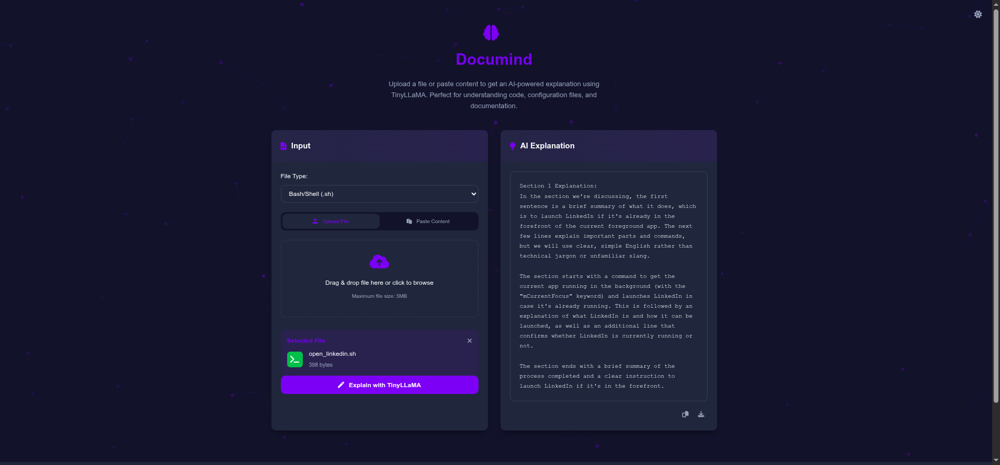

````markdown
# 📄 TinyLLaMA File Explainer App

A full-stack AI-powered application that explains files (code, configs, and text) using Ollama language models. Built with **FastAPI** for the backend and a lightweight **HTML/JS frontend UI**.

---

## 🔍 Features

- ✅ **Chunked Processing** for large files
- 🔁 **Model Fallback** to alternative LLMs if the primary fails
- 🧠 **CPU/GPU Support**
- 🖥️ **System Monitoring**: memory/disk/Ollama status
- 🔧 **Fix Models** on the fly via `/fix-model`
- 💻 **Frontend Web Interface** included

---

## 📸 Screenshot

> Save your screenshot in a folder like `screenshots/` and reference the image path.

### 🧠 Frontend UI



---

## 🧰 Requirements

- Python 3.9+
- [Ollama](https://ollama.ai) installed and running
- Installed models: `tinyllama`, `llama2`, `gemma:2b`, `phi` (or edit fallback list)

---

## 🚀 Installation

### Backend Setup

```bash
pip install fastapi uvicorn httpx anyio

ollama serve

ollama pull tinyllama
ollama pull llama2
ollama pull gemma:2b
ollama pull phi
```
````

### Frontend Setup

```bash
cd frontend/
python -m http.server 8080
```

---

## ▶️ Running the App

### Backend

```bash
uvicorn backend:app --reload
```

- Opens: [http://localhost:8000](http://localhost:8000)

### Frontend

```bash
cd frontend/
python -m http.server 8080
```

- Opens: [http://localhost:8080](http://localhost:8080)

---

## 📡 API Endpoints

- `POST /explain` — File explanation
- `GET /health` — Health check
- `GET /ollama-status` — Ollama status
- `POST /fix-model` — Re-pull broken model

---

## ⚙️ Configuration (`backend.py`)

| Setting              | Default             | Description               |
| -------------------- | ------------------- | ------------------------- |
| `OLLAMA_MODEL`       | `"tinyllama"`       | Primary model             |
| `FALLBACK_MODELS`    | `["llama2", "phi"]` | Fallback LLMs             |
| `MAX_CONTENT_LENGTH` | `5000`              | Max chars before chunking |
| `CPU_ONLY`           | `True`              | Force CPU only mode       |

---

## 🧪 Sample Response

```json
{
  "explanation": "Section 1 Explanation:\nThis Python script prints 'Hello World'...",
  "status": "success"
}
```

---

## 🛠️ Troubleshooting

- ❌ `"Failed to connect to Ollama"` — Run `ollama serve`
- ⚠️ `"Empty explanation"` — Lower `MAX_CONTENT_LENGTH`
- 🔒 `"Permission denied"` — Use `CPU_ONLY=True`
- 🧱 Model broken? Use `/fix-model`

## 🧑‍💻 Contributing

1. Fork this repo
2. Create a new branch
3. Make your changes
4. Open a Pull Request

---

## 📄 License

MIT License — See [LICENSE](LICENSE)
